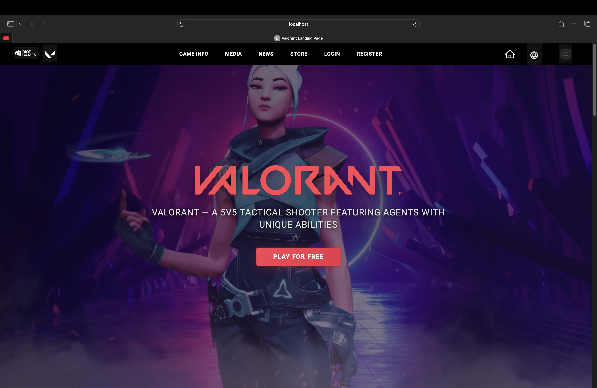
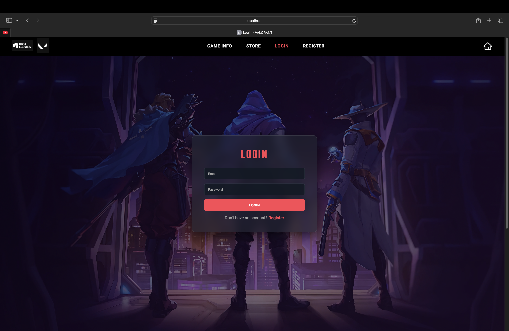
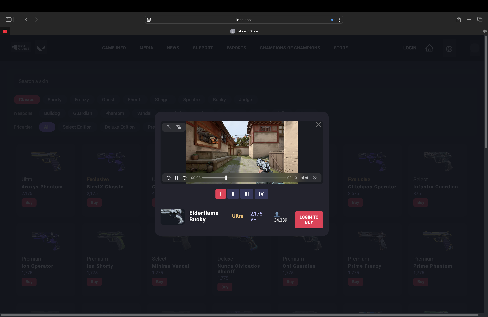
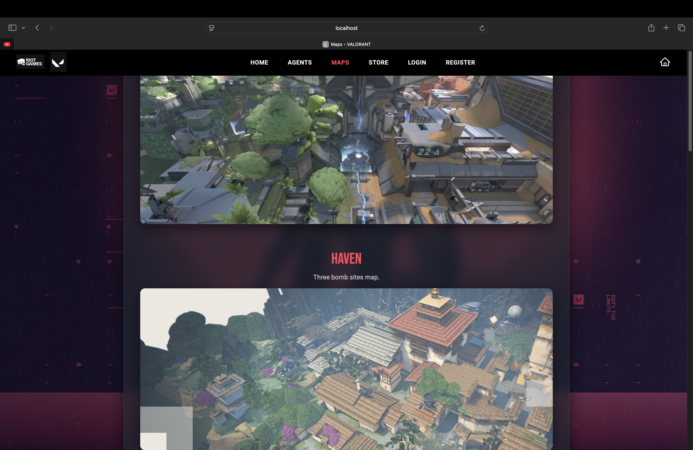
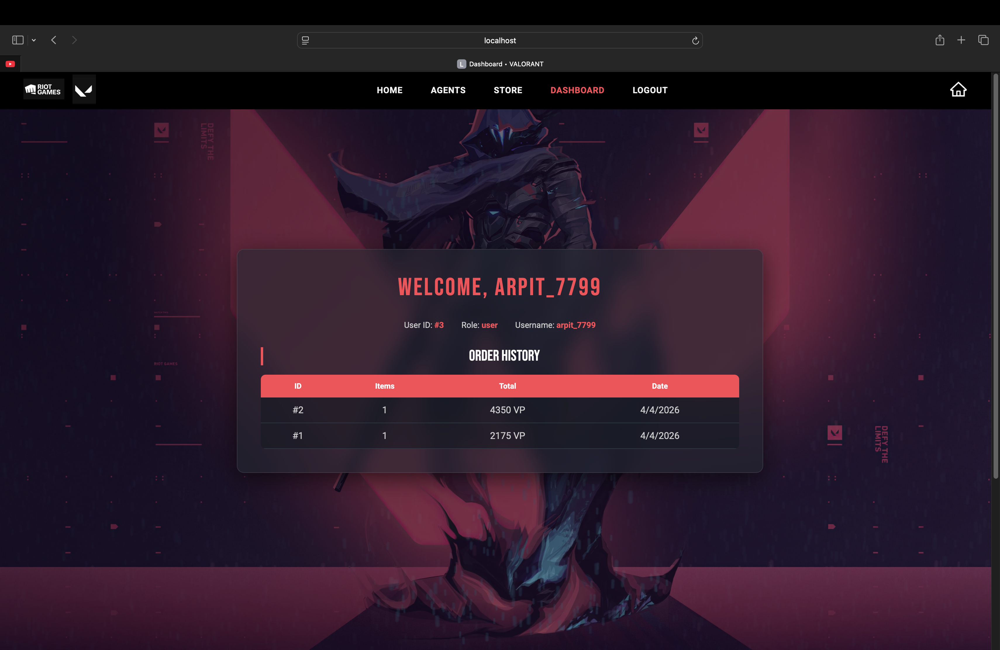

# 🎮 ValoraX

**Valora** is a full-stack Valorant-inspired web application that simulates a gaming ecosystem with authentication, store management, map exploration, and admin controls.

Built using **Node.js, Express, MySQL, and EJS**, the project focuses on dynamic data rendering, scalable architecture, and real-world backend integration.

---

## 📸 Screenshots

### 🏠 Home Page


### 🔐 Login Page


### 🛒 Store Page


### 🗺 Maps Page


### 📊 Dashboard


---

## 🚀 Features

### 🔐 Authentication System
- User registration & login  
- Session-based authentication  
- Role-based access control (User / Admin)  

### 🛒 Store System
- Dynamic item listing from MySQL  
- Purchase simulation flow  
- Order tracking system  

### 🗺 Maps Module
- Maps stored and fetched from database  
- Dynamic rendering using EJS templates  
- Easily scalable (add new maps via DB)  

### 📊 Dashboard
- Displays user profile details  
- Shows order history  
- Quick access to admin panel (if authorized)  

### 🛠 Admin Panel
- Add, edit, and delete items (CRUD)  
- Full database-driven content management  

---

## 🛠 Tech Stack

### 💻 Backend
- Node.js  
- Express.js  

### 🗄 Database
- MySQL (Relational Database)  
- Tables:
  - users  
  - items  
  - orders  
  - order_items  
  - maps  
  - agents  

### 🎨 Frontend
- EJS (Embedded JavaScript Templates)  
- HTML5  
- CSS3  

### ⚙️ Tools & Packages
- mysql2  
- dotenv  
- nodemon  
- Git & GitHub  
- VS Code  

---

## 📂 Project Structure

```
valora/
│── public/          # Static assets (CSS, images, videos)
│── views/           # EJS templates
│── server.js        # Main application entry point
│── db.js            # Database configuration
│── package.json     # Dependencies and scripts
│── database.sql     # Full database schema
│── screenshots/     # UI screenshots for preview
│── README.md        # Project documentation
```

---

## ⚙️ Setup Instructions

### 1️⃣ Clone the Repository

```bash
git clone https://github.com/arpit7799/ValoraX.git
cd ValoraX
```

### 2️⃣ Install Dependencies

```bash
npm install
```

### 3️⃣ Configure Environment Variables

Create a `.env` file in the root directory:

```env
DB_HOST=localhost
DB_USER=root
DB_PASSWORD=yourpassword
DB_NAME=valorant
```

### 4️⃣ Setup Database

```sql
CREATE DATABASE valorant;
```

Then import:

```
database.sql
```

### 5️⃣ Run the Application

```bash
npm start
```

or

```bash
npx nodemon server.js
```

### 6️⃣ Open in Browser

```
http://localhost:3000
```

---

## 📈 Future Improvements

- 💳 Payment gateway integration  
- ☁️ Cloud deployment (AWS / Render)  
- 🔗 REST API architecture  
- 🔍 Search & filtering system  
- 📄 Pagination for large datasets  
- 🗺 Detailed map pages (`/maps/:id`)  

---

## 🧠 Key Learning Outcomes

- Built a full-stack application using MVC architecture  
- Integrated MySQL with Node.js backend  
- Implemented dynamic rendering using EJS  
- Designed a scalable database-driven system  
- Developed authentication and CRUD operations  

---

## 👨‍💻 Author

**Arpit Pandey**
**Arnav Yadav**

---

## ⭐ Support

If you found this project useful:

- Give it a ⭐ on GitHub  
- Share feedback or suggestions  
